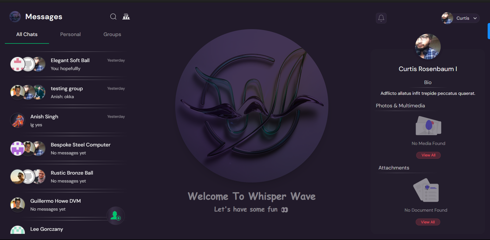
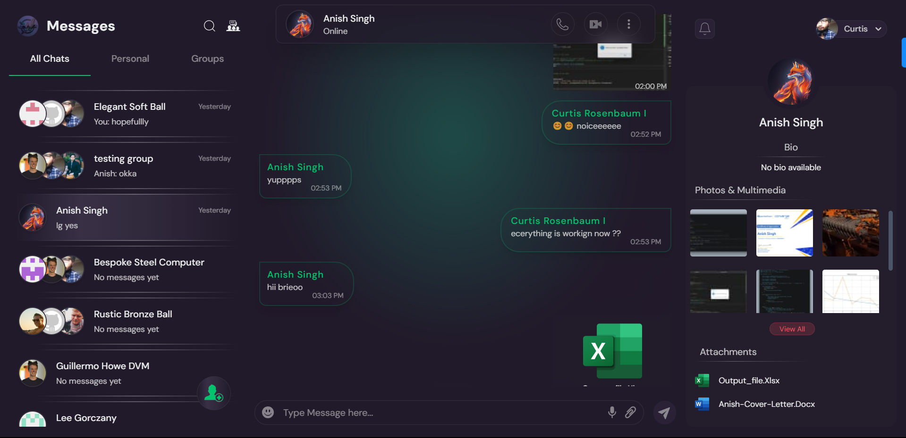
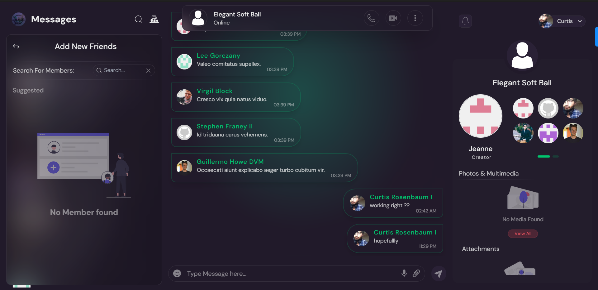
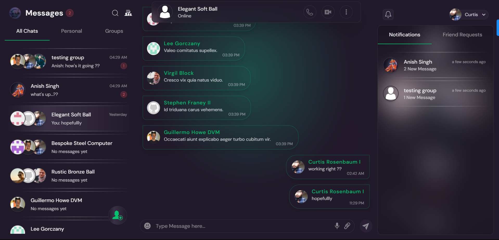

# Whisper Wave

Whisper Wave is a real-time chat application built with the MERN (MongoDB, Express.js, React, Node.js) stack. It offers a seamless and interactive messaging experience with advanced features.



## Features

- Real-time messaging using Socket.IO
- User authentication with JWT
- Friend request system
- Emoji reactions
- File uploads
- Real-time notifications for new messages and friend requests
- Responsive design for mobile and desktop

## Tech Stack

- Frontend: React, Redux Toolkit, React Router
- Backend: Node.js, Express.js
- Database: MongoDB
- Real-time Communication: Socket.IO
- Authentication: JSON Web Tokens, bcrypt
- File Processing: Jimp, FFmpeg
- Styling: TailwindCSS

## Screenshots

### Chat Interface



### Friend Requests



### Notifications



## Installation Guide

### Requirements

- [Nodejs](https://nodejs.org/en/download)
- [Mongodb](https://www.mongodb.com/docs/manual/administration/install-community/)

Both should be installed and make sure mongodb is running.

### Installation

```shell
git clone https://github.com/An525ish/Whisper-wave.git
cd Whisper-wave
```

Set up environment variables:
Create a `.env` file in the server directory and add necessary variables (MongoDB URI, JWT secret, etc.)

Now install the dependencies

```shell
cd client
npm install
cd ..
cd server
npm install
```

We are almost done, Now just start the development server.

For Frontend.

```shell
cd client
npm run dev
```

For Backend.

Open another terminal in folder, Also make sure mongodb is running in background.

```shell
cd server
npm run server
```

```
Done! Now open localhost:5173 in your browser.
```
