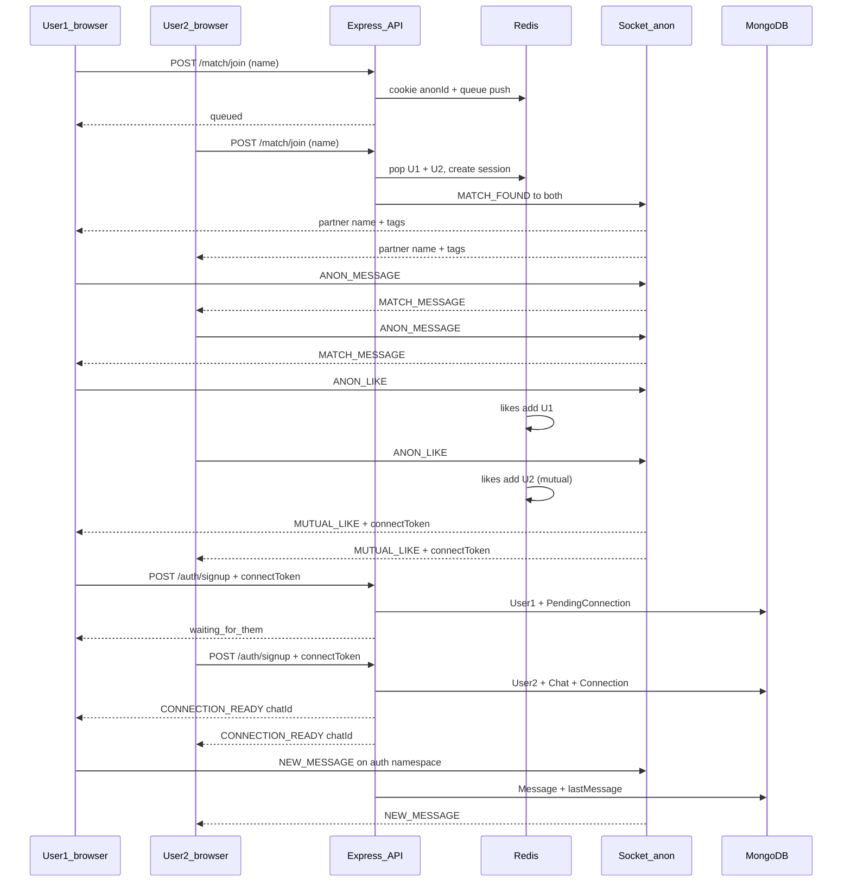

# Whisper Wave — User Journey (backend view)

> Living document. What the user does, and what **we** do on the server, at every step.
> Last updated: Aug 2026
>
> Product: [`PRODUCT.md`](./PRODUCT.md) · Tech + cost: [`TECH.md`](./TECH.md)

This is written for **Phase 2+** (anonymous → connect → premium).  
Phase 1 only builds the **connected** half (login → DMs/groups). After Phase 1, a user can already do Journey B. Journey A/C/D need the anonymous layer.

---

## Big picture

```
Open app
   → (optional) type a vibe name
   → Find someone                    [queue]
   → Matched with a stranger         [anon room]
   → Chat / like / skip / leave
   → If both like → Connect
   → Signup or login                 [account]
   → Wait until they also connect    [pending]
   → Real DM unlocks                 [Mongo chat]
   → Groups, friends, media…         [existing app]
   → Optional: Spark Pass            [premium]
   → Optional: anonymous again, with filters
```

Two kinds of identity:

| Who they are | Backend id | Stored where |
|---|---|---|
| Stranger (not logged in) | `anonId` (cookie) | Redis only, dies with the session |
| Account holder | `userId` (JWT cookie) | MongoDB, permanent |

---

## Journey A — Brand new person (the main story)

### A0. They open the app

**User:** Opens the website. No account. Sees “enter a name + find someone”.

**Backend:** Almost nothing.
- Frontend loads (static).
- Optional `GET /health` if we ping the API.
- No cookie yet. No DB write.

---

### A1. They pick a vibe name and hit “Find someone”

**User:** Types a name (e.g. `midnight_fox`), maybe 2–3 vibe tags, maybe gender. Hits Find.

**Backend:** `POST /api/match/join` (no login required)

1. Validate body (name required, tags optional, gender optional).
2. Create `anonId` = random UUID.
3. Set httpOnly cookie `anonId` (so we know this browser in later socket calls).
4. Save a short “waiting card” in Redis:
   - `match:waiting:{anonId}` → `{ displayName, vibeTags, gender, joinedAt }`
   - TTL ~ 10–15 min (if they go idle, they drop out of queue).
5. Put `anonId` at the end of the queue:
   - Free user → `match:queue:global`
   - (Premium filter is Journey D — skip for now.)
6. Try to match immediately (see A2).
7. Respond: `{ ok: true, status: "queued" | "matched" }`.

**We do not:** create a User, save to Mongo, log IP as a profile.

---

### A2. Waiting in queue → we pair two people

**User:** Sees a waiting animation.

**Backend:** Same request as A1, or a tiny matcher that runs on every join.

Logic (cheap, no extra worker):

1. Look at the queue. Is there already someone waiting?
2. **No** → this user just waits. Socket event `QUEUE_JOINED`.
3. **Yes** → pop that person + this person.
4. Create `sessionId` (room id).
5. Write Redis hash `match:session:{sessionId}`:
   - `anon1`, `anon2`, names, tags, `status: active`, `createdAt`
   - TTL 24h after last activity (or shorter — product choice).
6. Empty likes set: `match:likes:{sessionId}`.
7. Tell both sockets `MATCH_FOUND`:
   - Partner’s **display name + vibe tags only**
   - Never send the other person’s `anonId` to the client (harder to stalk/replay).
8. Put both sockets in Socket.IO room `sessionId`.

**We do not:** write this pair to Mongo. If the server restarts and Redis is empty, the match is gone — that is OK for anonymous.

---

### A3. They chat (anonymous)

**User:** Types messages, maybe typing indicator.

**Backend:** Socket.IO namespace `/anon` (not the logged-in namespace).

| User does | Client sends | We do |
|---|---|---|
| Types a message | `ANON_MESSAGE` `{ sessionId, content }` | Check cookie `anonId` is actually in this session. Relay to the **other** socket only. Do **not** save in Mongo. Optional: keep last few lines in a Redis list with TTL (only if we want refresh-to-not-lose-the-thread). Default: **relay only**. |
| Starts typing | `ANON_TYPING_START` | Forward to partner. Nothing stored. |
| Stops typing | `ANON_TYPING_STOP` | Forward to partner. Nothing stored. |

If content looks empty / too long → drop it (Zod / simple max length). Rate-limit messages so bots can’t flood.

**We do not:** attachments, voice notes, read receipts (free anon). Those are connected or premium.

---

### A4. They tap Like

**User:** Hits the vibe/like button.

**Backend:** Socket `ANON_LIKE` `{ sessionId }` (or `POST /api/match/like`)

1. Confirm `anonId` belongs to this session.
2. `SADD match:likes:{sessionId} {anonId}`.
3. Count likes:
   - **Only 1 like:** optionally emit a vague `SOMEONE_VIBING` to the room (not “X liked you”). Or emit nothing — product choice. Do **not** reveal who.
   - **2 likes (mutual):** emit `MUTUAL_LIKE` to both, with a short-lived `connectToken` (JWT, ~10 min) containing:
     - `sessionId`
     - this user’s `anonId`
     - partner `anonId`
     - both vibe names + tags (for the “how we met” story)

**We do not:** create accounts yet. Like is only Redis.

---

### A5. They tap Next / Skip (no connect)

**User:** “Not it. Next.”

**Backend:** `ANON_NEXT` or `POST /api/match/next`

1. Mark session `ended` / delete Redis session + likes.
2. Tell partner `MATCH_DISCONNECTED` (“they left”).
3. Remove skipper from this room.
4. Put skipper back in the queue (same as A1–A2) **or** wait until they hit Find again.
5. Partner is **not** automatically re-queued unless they tap Find again (clearer UX, less surprise).

**Result:** that stranger is gone. No Mongo row. No way to look them up. That is the product.

---

### A6. They close the tab / lose network

**User:** Leaves without tapping anything.

**Backend:** Socket `disconnect` on `/anon`

1. If they were only in queue → remove from Redis queue + waiting card.
2. If they were in a live session → same as A5 for the partner (`MATCH_DISCONNECTED`), delete session.
3. Cookie `anonId` may still exist in the browser. Next visit they can get a **new** `anonId` (old one is useless without Redis). That’s fine.

---

### A7. Mutual like → they tap Connect

**User:** Sees “it’s a vibe” → Connect.

**Backend:** They already have `connectToken` from A4.  
If we want a dedicated call: `POST /api/match/connect` `{ sessionId }` → re-issue token if still valid.

Then the **frontend** shows signup (new) or login (already have an account).

Nothing permanent until A8/A9 succeeds.

---

### A8. New user signs up to keep this person

**User:** Email/username + password + avatar (same as today’s signup), plus hidden `connectToken`.

**Backend:** `POST /api/auth/signup` with `connectToken`

1. Validate signup fields. Hash password. Upload avatar (Cloudinary) — same as Phase 1 auth.
2. Verify `connectToken` (signature + not expired + session still makes sense).
3. Create **User** in Mongo. Set httpOnly **auth** cookie (`accessToken`).
4. Upsert **PendingConnection** in Mongo (this is the bridge):

```
PendingConnection {
  sessionId,
  sides: [
    { anonId, userId | null, displayName, vibeTags },
    { anonId, userId | null, displayName, vibeTags }
  ],
  expiresAt   // e.g. 7 days
}
```

5. This user is side A → we set `userId` on their side. Partner’s `userId` is still `null`.
6. Respond: account created + `{ connectionStatus: "waiting_for_them" }`.
7. They can use the logged-in app, but **this** DM does not exist yet.

**Why pending?** The other person may not have an account. We cannot create a 2-user Chat until both exist.

**We do not:** create Chat/Message yet. We do not keep the Redis anon transcript (unless we later decide to copy a snippet into origin story).

---

### A9. The other person also connects (or they already had an account)

**User B:** Signs up **or** logs in with the same `connectToken` / `POST /api/connection/complete` (if already logged in).

**Backend:**

1. Verify token / auth.
2. Find `PendingConnection` by `sessionId`.
3. Set B’s `userId`.
4. Now both sides have `userId` → **complete**:
   - Create **Chat** (DM, `groupChat: false`, members `[userA, userB]`).
   - Create **Connection** `{ users, chat, originNames, originVibeTags, originAnonSession, connectedAt }`.
   - Delete or mark pending as `completed`.
   - Delete Redis session if still there.
5. Emit to both (authenticated socket `/`): `CONNECTION_READY` `{ chatId }` so the UI opens the real DM.
6. From here, messages go through the **normal** connected pipeline (Mongo).

If B never comes back: pending expires. A keeps their account. They just don’t get that DM. Harsh, but honest.

---

### A10. They talk as real connections

**User:** Opens the DM, sends texts/files, later maybe groups / friends.

**Backend:** This is the **existing Whisper Wave** (Phase 1), just cleaned up.

| User does | Backend |
|---|---|
| Load chat list | `GET /api/chat/get-my-chats` — Mongo `Chat` where `members` includes `userId`. JWT auth, no extra User fetch. |
| Open a chat | `GET /api/chat/get-chat-details`, `GET /api/message/get-messages/:chatId` — paged, indexed `{ chat, createdAt }`. |
| Send text | Authenticated Socket.IO `/` → `NEW_MESSAGE`. Save **Message** in Mongo. Update `chat.lastMessage`. Emit to member sockets (in-memory map in Phase 1). |
| Send files | `POST /api/message/send-attachments` — compress → Cloudinary → Message + lastMessage. |
| Typing | `START_TYPING` / `STOP_TYPING` — relay only. |
| Friend request / groups / profile | Existing REST routes, still Mongo. |

Disconnect here does **not** delete the person. That’s the difference from anonymous.

---

## Journey B — They already have an account (return visit)

### B1. Open app

**User:** Comes back, still logged in (cookie) or hits login.

**Backend:**
- `POST /api/auth/signin` if needed → set cookie.
- `GET /api/user/get-profile` → who they are.
- `GET /api/chat/get-my-chats` → their connections.

No Redis. No anon.

### B2. They use the connected app

Same as A10. Friend requests, groups, media, logout (`POST /api/auth/signout` clears cookie).

---

## Journey C — Logged-in user goes anonymous again

**User:** Has an account, wants another stranger. Hits Find someone (maybe from a “Whisper” tab).

**Backend:** Same as A1–A6, with one extra:

1. They already have JWT **and** we may still set/use `anonId` for the stranger session (keep anon identity separate from account so the partner never sees `userId`).
2. If they later Connect with a new stranger → skip signup, just `POST /api/connection/complete` with `connectToken` + auth cookie (A9).
3. Premium flags are read from Mongo `Subscription` (Journey D) to pick the queue.

**We still do not** put this anon chat in their chat list unless both connect.

---

## Journey D — Spark Pass (premium)

### D1. They buy premium

**User:** Pricing page → pay.

**Backend (Phase 3, not $0-critical until then):**
1. `POST /api/subscription/create` → Stripe Checkout session.
2. Stripe webhook `POST /api/subscription/webhook` → write/update **Subscription** in Mongo (`plan: premium`, period end, Stripe ids).
3. Feature checks later read this document (or a `plan` field on User).

Until webhook succeeds, they stay free. We do not trust the client saying “I am premium”.

### D2. They match with filters

**User:** Find someone + gender preference (and later vibe/location).

**Backend:** `POST /api/match/join` with `genderPref`

1. Auth required for filters (must know they are premium).
2. If not premium → 403, ignore pref, use global queue.
3. If premium → push to `match:queue:pref:male` / `female` (or filtered match logic).
4. Matcher only pairs compatible queues.
5. Rest of A2–A6 unchanged.

Other premium backends (when we build them): priority (pop them first), voice notes, read receipts, re-find credits — all gated by the same Subscription read.

---

## Safety path (any journey)

| User does | Backend |
|---|---|
| Report | `POST /api/report` — save report in Mongo (reporter, target anonId or userId, sessionId/chatId, reason). Do not need the chat transcript if we didn’t store it. |
| Block | Store block list on User (connected) or a Redis/Mongo block between anonIds for the rest of the day. Matcher must skip blocked ids. |
| Safe exit | Same as A5/A6: leave immediately, partner only gets `MATCH_DISCONNECTED`. |

No paid AI moderation in $0 phase.

---

## What lives where, by step

```
A1–A6  anon queue + room + likes     → Redis only
A8     account created               → Mongo User
A8     waiting for partner           → Mongo PendingConnection
A9     both connected                → Mongo Connection + Chat
A10+   real messages / groups        → Mongo Message, Chat, Request
D1     paid                          → Mongo Subscription + Stripe
```

---

## Sequence (happy path: two strangers connect)



---

## Phase 1 vs this journey

| Journey piece | When we build it |
|---|---|
| B + A10 (login, DMs, groups, media, sockets) | **Phase 1 now** — refactor existing server |
| A0–A7 (queue, anon room, like, skip) | Phase 2 |
| A8–A9 (PendingConnection → Connection) | Phase 2 |
| C (logged-in user whispers again) | Phase 2 |
| D (Stripe + gender queue) | Phase 3 |
| Report/block APIs | Phase 2 minimum; AI later |

Phase 1 should still structure auth/sockets/models so A8–A10 can plug in without another rewrite (`User`, `Chat`, `Message` stay; we add `PendingConnection` + `Connection` later).

---

## Open backend choices (not blockers for Phase 1)

- Anon messages: relay-only vs last-N in Redis for refresh.
- After skip: auto re-queue or wait for Find.
- One-sided like: silent vs “someone is vibing”.
- PendingConnection TTL if the other person never signs up.
- Logged-out Connect: force signup first (A8) vs allow login (A9) on the same screen.
