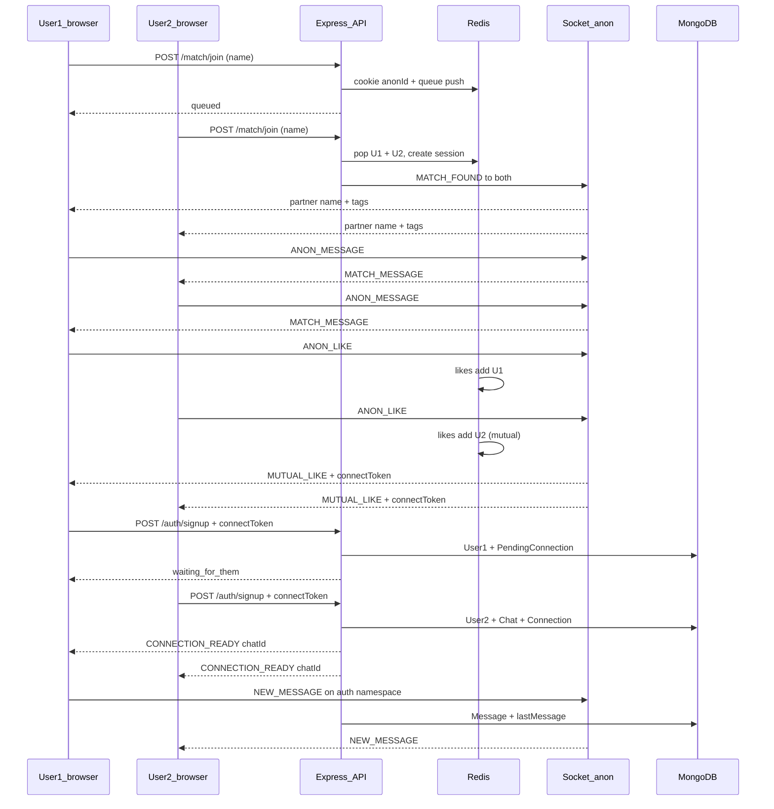

# Whisper Wave — User Journey (backend view)

> Living document. What the user does, and what **we** do on the server, at every step.
> Last updated: Oct 2026
>
> Product: [`PRODUCT.md`](./PRODUCT.md) · Tech + cost: [`TECH.md`](./TECH.md)

This is written for **Phase 2+** (anonymous → connect → premium).  
Phase 1 only builds the **connected** half (login → DMs/groups). After Phase 1, a user can already do Journey B. Journey A/C/D need the anonymous layer.

---

## Big picture

```
Open app
   → (optional) type a vibe name
   → Find someone                    [queue]
   → Matched with a stranger         [anon room]
   → Chat / like / skip / leave
   → If both like → Connect
   → Signup or login                 [account]
   → Wait until they also connect    [pending]
   → Real DM unlocks                 [Mongo chat]
   → Groups, friends, media…         [existing app]
   → Optional: Spark Pass            [premium]
   → Optional: anonymous again, with filters
```

Two kinds of identity:

| Who they are | Backend id | Stored where |
|---|---|---|
| Stranger (not logged in) | `anonId` (cookie) | Redis only, dies with the session |
| Account holder | `userId` (JWT cookie) | MongoDB, permanent |

---

## Journey A — Brand new person (the main story)

### A0. They open the app

**User:** Opens the website. No account. Sees “enter a name + find someone”.

**Backend:** Almost nothing.
- Frontend loads (static).
- Optional `GET /health` (liveness) if we ping the API; `/ready` also checks Redis.
- No cookie yet. No DB write.

---

### A1. They pick a vibe name and hit “Find someone”

**User:** Types a name (e.g. `midnight_fox`), up to 3 freeform vibe tags, maybe gender, and ticks the 18+ box. Hits Find.

**Backend:** `POST /api/match/join` (no login required)

1. Validate body (name, tags ≤ 3 freeform, optional gender, 18+ attestation).
2. Reuse the `anonId` cookie or create one (random UUID, httpOnly).
3. Save the **identity card** in Redis: `match:waiting:{anonId}` → `{ displayName, vibeTags, gender, joinedAt }`, **TTL 24 h**, refreshed on every interaction.
4. Respond `{ ok: true }`.

`/join` does **not** queue anyone. The queue entry is created when the client's `/anon` socket connects, after the quota (signed-in users only) and active-session gates. Then:

- Free user → `anonId` is added to `match:queue:global`.
- (Premium filter is Journey D — not built.)
- Matching is tried immediately (see A2).

**We do not:** create a User, save to Mongo, log IP as a profile.

---

### A2. Waiting in queue → we pair two people

**User:** Sees a waiting animation.

**Backend:** A matcher runs on every queue entry. Claiming is atomic (Lua `LREM`, no global lock).

1. Is someone already waiting (and not blocked, not the same account)?
2. **No** → this user waits. Socket event `QUEUE_JOINED`.
3. **Yes** → claim that person atomically.
4. Create `sessionId`; write `match:session:{sessionId}` (anonIds, names, tags, `status: active`), TTL 24 h.
5. Empty likes set `match:likes:{sessionId}`.
6. Emit `MATCH_FOUND` to both: partner's **display name + vibe tags only**. **We never send anonIds to the client.**
7. Both sockets join the session room.

**We do not:** write this pair to Mongo.

---

### A3. They chat (anonymous)

**User:** Types messages, maybe a typing indicator, may react to a message.

**Backend:** Socket.IO namespace `/anon` (not the logged-in namespace).

| User does | Client sends | We do |
|---|---|---|
| Types a message | `ANON_MESSAGE` `{ content, messageId }` | Verify the cookie `anonId` is in this session. Moderate + length/rate checks. **Ack** the sender (or `MATCH_MESSAGE_REJECTED`). Relay to the partner as `MATCH_MESSAGE` with `from: 'them'` (sender sees `'me'`). Keep the **last 50 messages** in `match:messages:{sessionId}` (TTL 24 h) so a refresh or the 45 s reconnect grace doesn't blank the thread. Never Mongo. |
| Reacts to a message | `ANON_REACT` | Curated set only; stored in `match:reactions:*`; `MATCH_REACTION` to both. Sending the same reaction again removes it. |
| Starts/stops typing | `ANON_TYPING_START/STOP` | Forward to partner. Nothing stored. |

**We do not:** attachments, voice notes, read receipts (free anon). When the session ends, the buffer and reactions are **deleted**.

---

### A4. They tap Like

**User:** Hits the vibe/like button. It unlocks only after the vibe gate (≥ 90 s, ≥ 2 messages from each side, ≥ 5 total; per-side counters).

**Backend:** Socket `ANON_LIKE`

1. Confirm `anonId` belongs to this session and the gate is met.
2. `SADD match:likes:{sessionId} {anonId}`.
3. Count likes:
   - **1 like:** emit a vague `SOMEONE_VIBING` and set the replayable `MATCH_PARTNER_VIBED` flag for the partner. Never reveals who.
   - **2 likes (mutual):** emit `MUTUAL_LIKE` to both with a short-lived `connectToken` (JWT, ~10 min) containing `sessionId` and both vibe names + tags (for “how we met”). **No anonIds in the token.**

**We do not:** create accounts yet. Like is only Redis.

---

### A5. They tap Next / Skip (no connect)

**User:** “Not it. Next.”

**Backend:** `ANON_NEXT`

1. End the session; delete the Redis session, likes, message buffer and reactions.
2. Tell the partner `MATCH_DISCONNECTED` (“they left”); they return to idle.
3. The skipper is re-queued by the server on `ANON_NEXT` (the client first refreshes the card via `POST /api/match/join`).
4. The partner is **not** silently requeued — they must tap Find again.

**Result:** that stranger is gone. No Mongo row. That is the product.

---

### A6. They close the tab / lose network

**User:** Leaves without tapping anything.

**Backend:** Socket `disconnect` on `/anon`

1. Only in queue → removed from the queue (the identity card stays until TTL).
2. In a live session → a **45 s grace period** starts (`match:presence:{anonId}` + a sweep entry). A reconnect (refresh, flaky network) resumes the session and replays the buffer.
3. If the grace lapses → same as A5 for the partner (`MATCH_DISCONNECTED`), session and transcript deleted. The sweeper is armed on demand and at boot; the queue is purged at boot.

---

### A7. Mutual like → they tap Connect

**User:** Sees “it’s a vibe” → Connect.

**Backend:** They already have `connectToken` from `MUTUAL_LIKE`. The client **holds it in sessionStorage** (it survives the sign-in/up redirect, not a closed tab). Nothing permanent until A8/A9 succeeds.

---

### A8. New user signs up to keep this person

**User:** Signs up (or signs in) through the normal auth screens; the origin story is shown on them.

**Backend:** Normal auth first, **then** `POST /api/connection/complete` with the token — the connect step is **not** part of signup.

1. Signup/signin as in Phase 1 (R2/ImageKit avatar, httpOnly auth cookie).
2. `POST /api/connection/complete` `{ connectToken }` (authenticated): verify signature/expiry, bind the caller's `userId` to their own side only, reject one account on both sides.
3. Upsert **PendingConnection** (`sessionId`, two sides with `userId | null`, names, tags, 7-day expiry).
4. Respond `{ status: "waiting_for_them" }`.

**Why pending?** The other person may not have an account yet.

**We do not:** create Chat/Message yet, or copy any anonymous message into the origin story.

---

### A9. The other person also connects (or they already had an account)

**User B:** Signs up **or** signs in, then calls `POST /api/connection/complete` with their own token.

**Backend:**

1. Verify token + auth; find `PendingConnection` by `sessionId`; set B's side.
2. Both sides have `userId` → **complete**: create **Chat** (DM), create **Connection** (`pairKey` unique per user pair), remove the pending record.
3. Emit to both: `CONNECTION_READY` on the `/anon` socket (if still connected) and **`WHISPER_CONNECTION_READY`** (+ `REFETCH_CHATS`) on the authenticated `/` socket, so the UI opens the real DM.
4. From here, messages use the **normal** connected pipeline (Mongo).

If B never comes back: pending expires after 7 days; A gets no notification.

---

### A10. They talk as real connections

**User:** Opens the DM, sends texts/files, later maybe groups / friends.

**Backend:** This is the **existing Whisper Wave** (Phase 1), just cleaned up.

| User does | Backend |
|---|---|
| Load chat list | `GET /api/chat/get-my-chats` — Mongo `Chat` where `members` includes `userId`. Each item includes `unreadCount` from `ChatRead` cursor + Message counts. JWT auth. |
| Open a chat | `GET /api/chat/get-chat-details`, `GET /api/message/get-messages/:chatId` — paged. Client calls `PUT /api/chat/:chatId/read` to upsert `ChatRead`, `$addToSet` `Message.readBy`, emit `CHAT_READ` to peers (DM receipts). |
| Send text | Authenticated Socket.IO `/` → `NEW_MESSAGE`. Save **Message** in Mongo. Update `chat.lastMessage`. Emit `NEW_MESSAGE` + `NEW_MESSAGE_ALERT` (receivers only) + `REFETCH_CHATS`. |
| Send files | `POST /api/message/send-attachments` — compress → R2 (ImageKit delivery) → Message + lastMessage. Alert excludes sender. |
| Typing | `START_TYPING` / `STOP_TYPING` — relay only. |
| Read / unread | Per-user `ChatRead` (`chat`+`user` unique). Unread = messages from others with `createdAt > lastReadAt` (no cursor → count all from others). DM receipts via `readBy` + `CHAT_READ`. `PUT /api/chat/read-all` marks every chat read. Message notification “Clear all” dismisses the inbox only and does not change unread. |
| Friend request / groups / profile | Existing REST routes, still Mongo. New chats init `ChatRead` for members at create time. Groups use `creator` + `admins[]` roles (creator/admin can delete any message; creator-only clear-all / delete group / promote admins). |

Disconnect here does **not** delete the person. That’s the difference from anonymous.

---

## Journey B — They already have an account (return visit)

### B1. Open app

**User:** Comes back, still logged in (cookie) or hits login. Signed-in users can also reach `/whisper` from the chat-list menu (Journey C).

**Backend:**
- `POST /api/auth/signin` if needed → set cookie.
- `GET /api/user/get-profile` → who they are.
- `GET /api/chat/get-my-chats` → their connections.

No Redis. No anon.

### B2. They use the connected app

Same as A10. Friend requests, groups, media, logout (`POST /api/auth/signout` clears cookie).

---

## Journey C — Logged-in user goes anonymous again

**User:** Has an account, wants another stranger. Chat-list menu → “Whisper — talk to someone new” → `/whisper`.

**Backend:** Same as A1–A6, with extras:

1. They keep their JWT **and** get an `anonId` for the stranger session (anon identity stays separate so the partner never sees `userId`).
2. Signed-in users have a rolling 24 h whisper quota (`match:whispers:{userId}`); an account can't match its own other device (`match:user:{userId}`).
3. If they Connect with the stranger → skip signup, `POST /api/connection/complete` with the token + auth cookie (A9).
4. Premium flags (Journey D) are not built yet.

**We still do not** put this anon chat in their chat list unless both connect.

---

## Journey D — Spark Pass (premium)

### D1. They buy premium

**User:** Pricing page → pay.

**Backend (Phase 3, not $0-critical until then):**
1. `POST /api/subscription/create` → Stripe Checkout session.
2. Stripe webhook `POST /api/subscription/webhook` → write/update **Subscription** in Mongo (`plan: premium`, period end, Stripe ids).
3. Feature checks later read this document (or a `plan` field on User).

Until webhook succeeds, they stay free. We do not trust the client saying “I am premium”.

### D2. They match with filters

**User:** Find someone + gender preference (and later vibe/location).

**Backend:** `POST /api/match/join` with `genderPref`

1. Auth required for filters (must know they are premium).
2. If not premium → 403, ignore pref, use global queue.
3. If premium → push to `match:queue:pref:male` / `female` (or filtered match logic).
4. Matcher only pairs compatible queues.
5. Rest of A2–A6 unchanged.

Other premium backends (when we build them): priority (pop them first), voice notes, read receipts, re-find credits — all gated by the same Subscription read.

---

## Safety path (any journey)

| User does | Backend |
|---|---|
| Report | `POST /api/report` — save report in Mongo (reporter, target anonId or userId, sessionId/chatId, reason). Do not need the chat transcript if we didn’t store it. |
| Block | Store block list on User (connected) or a Redis/Mongo block between anonIds for the rest of the day. Matcher must skip blocked ids. |
| Safe exit | Same as A5/A6: leave immediately, partner only gets `MATCH_DISCONNECTED`. |

No paid AI moderation in $0 phase.

---

## What lives where, by step

```
A1–A6  anon queue + room + likes     → Redis only
A8     account created               → Mongo User
A8     waiting for partner           → Mongo PendingConnection
A9     both connected                → Mongo Connection + Chat
A10+   real messages / groups        → Mongo Message, Chat, Request
D1     paid                          → Mongo Subscription + Stripe
```

---

## Sequence (happy path: two strangers connect)


```mermaid
sequenceDiagram
    participant U1 as User1_browser
    participant U2 as User2_browser
    participant API as Express_API
    participant Redis as Redis
    participant S as Socket_anon
    participant DB as MongoDB

    U1->>API: POST /match/join (name)
    API->>Redis: cookie anonId + queue push
    API-->>U1: queued

    U2->>API: POST /match/join (name)
    API->>Redis: pop U1 + U2, create session
    API->>S: MATCH_FOUND to both
    S-->>U1: partner name + tags
    S-->>U2: partner name + tags

    U1->>S: ANON_MESSAGE
    S-->>U2: MATCH_MESSAGE
    U2->>S: ANON_MESSAGE
    S-->>U1: MATCH_MESSAGE

    U1->>S: ANON_LIKE
    Redis->>Redis: likes add U1
    U2->>S: ANON_LIKE
    Redis->>Redis: likes add U2 (mutual)
    S-->>U1: MUTUAL_LIKE + connectToken
    S-->>U2: MUTUAL_LIKE + connectToken

    U1->>API: POST /auth/signup + connectToken
    API->>DB: User1 + PendingConnection
    API-->>U1: waiting_for_them

    U2->>API: POST /auth/signup + connectToken
    API->>DB: User2 + Chat + Connection
    API-->>U1: CONNECTION_READY chatId
    API-->>U2: CONNECTION_READY chatId

    U1->>S: NEW_MESSAGE on auth namespace
    API->>DB: Message + lastMessage
    S-->>U2: NEW_MESSAGE
```

---

## Phase 1 vs this journey

| Journey piece | When we build it |
|---|---|
| B + A10 (login, DMs, groups, media, sockets) | **Phase 1 now** — refactor existing server |
| A0–A7 (queue, anon room, like, skip) | Phase 2 |
| A8–A9 (PendingConnection → Connection) | Phase 2 |
| C (logged-in user whispers again) | Phase 2 |
| D (Stripe + gender queue) | Phase 3 |
| Report/block APIs | Phase 2 minimum; AI later |

Phase 1 should still structure auth/sockets/models so A8–A10 can plug in without another rewrite (`User`, `Chat`, `Message` stay; we add `PendingConnection` + `Connection` later).

---

## Open backend choices (not blockers for Phase 1)

- Anon messages: relay-only vs last-N in Redis for refresh.
- After skip: auto re-queue or wait for Find.
- One-sided like: silent vs “someone is vibing”.
- PendingConnection TTL if the other person never signs up.
- Logged-out Connect: force signup first (A8) vs allow login (A9) on the same screen.
